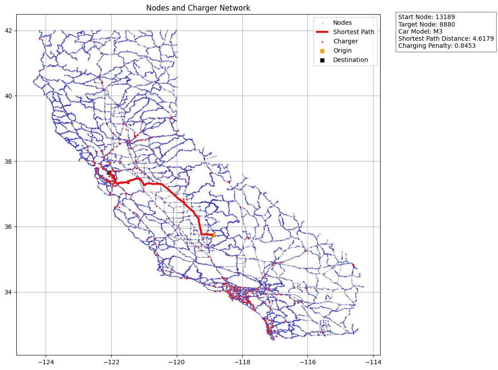

# 🚗⚡ EV Route Optimizer: Charge Smart, Drive Far

Navigate the future of travel with our EV Route Optimizer! This project revolutionizes route planning for electric vehicles by finding the optimal path while considering charging constraints.

## 🌟 Features

- 🗺️ Interactive maps powered by Folium
- 🔋 Smart charging station integration
- 🚙 Support for multiple Tesla models
- 📊 Data visualization with Matplotlib and Seaborn
- 🧮 Advanced pathfinding with modified Dijkstra's algorithm

## 🚀 Getting Started

### Prerequisites

- Python 3.7+
- pip

### Installation

Clone the repo:
git clone https://github.com/utsavmajumdar14/charge_constrained_route_optimization.git

Select your start point, destination, and Tesla model to visualize the optimal route!

#### Assumption
The distance here is an L2 distance whose units are unknown.
However, I calculated and figured 1 L2 unit would almost be equivalent to 60 miles.
The range, charging speed and charging capacity of the Tesla vehicles are an assumption since this repository focuses more on the algorithm.

## Folders
#### Toy
Here I used a hypothetical toy network to test out the algorithm
#### Final
The algorithm is executed on California map
#### New Data
1. The supercharger data is obtained from https://www.kaggle.com/datasets/omarsobhy14/supercharge-locations
2. The road networks are obtained from https://users.cs.utah.edu/~lifeifei/SpatialDataset.htm

## 🛠️ Tech Stack

- NumPy & Pandas: Data manipulation
- Matplotlib & Seaborn: Data visualization
- Folium: Interactive maps
- GeoPandas: Geospatial data handling
- NetworkX: Graph operations
- ipywidgets: Interactive UI components

## 📸 Screenshots

*Optimal route with charging stations*

*User-friendly interface for route planning*

## 📄 License

This project is licensed under the MIT License - see the [LICENSE](LICENSE) file for details.

## 🙏 Acknowledgments

- Tesla for inspiring the future of electric mobility
- OpenStreetMap contributors for geospatial data
- The open-source community for amazing tools and libraries

---

Ready to optimize your EV journey? Star ⭐ this repo! 🌍🔌🚗
